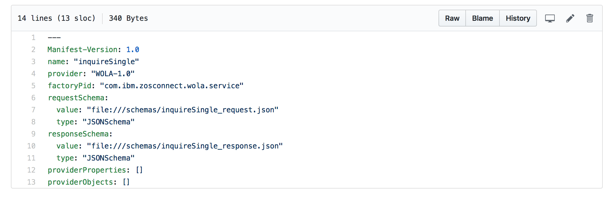
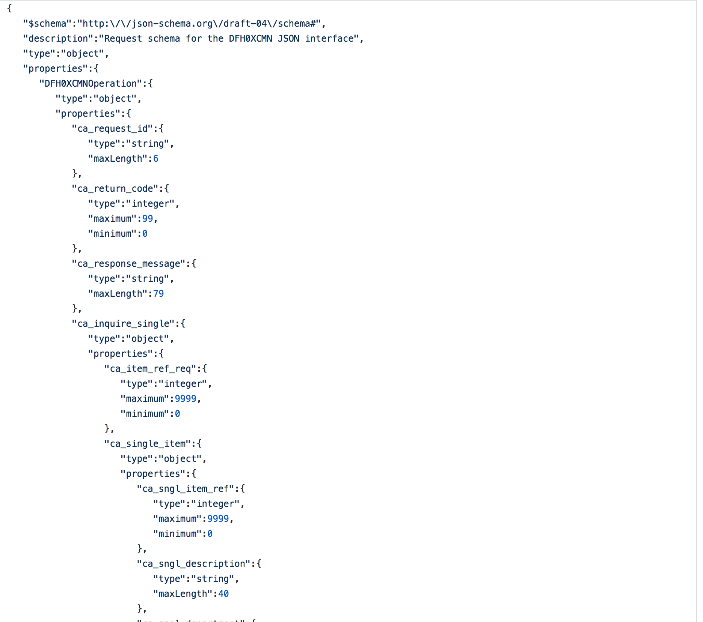

# Service Archive Files
Service archive files(.sar)  are ZIP-format files produced by the baqls2js utility that contain both JSON schema files and meta-data related to the service.
The SAR files are used as input to the z/OS Connect EE V2.0 API Editor for it to understand the service and data fields present. 

To understand more of the .sar files, please go to **Service Archive Files Samples** folder. In that, we provide the content of inquireSingle under the folder name **inquireSingle**.    
The first file under **inquireSingle** is the manifest.yml. It describles the service name, id, and the requestSchema, responseSchema.   

Under **schemas** folder, we see the two schema jsons described in the manifest.yml file. Here is a snapshot of the request schema file, which defines properties in the request. It also defines which properties are required.

